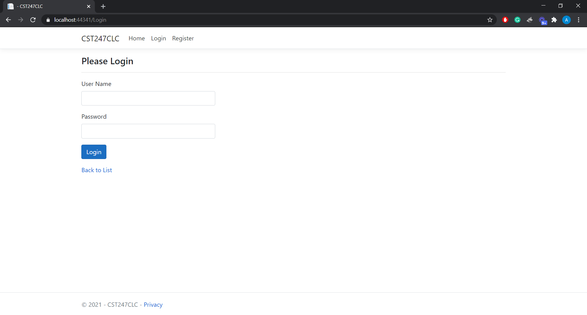
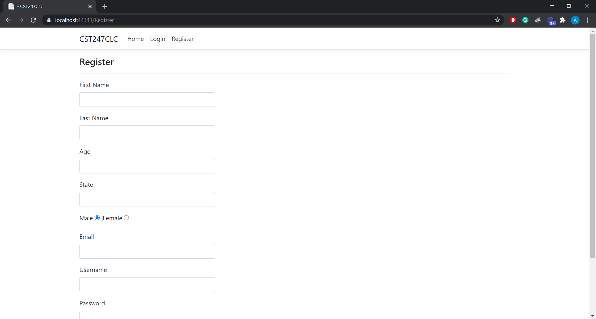
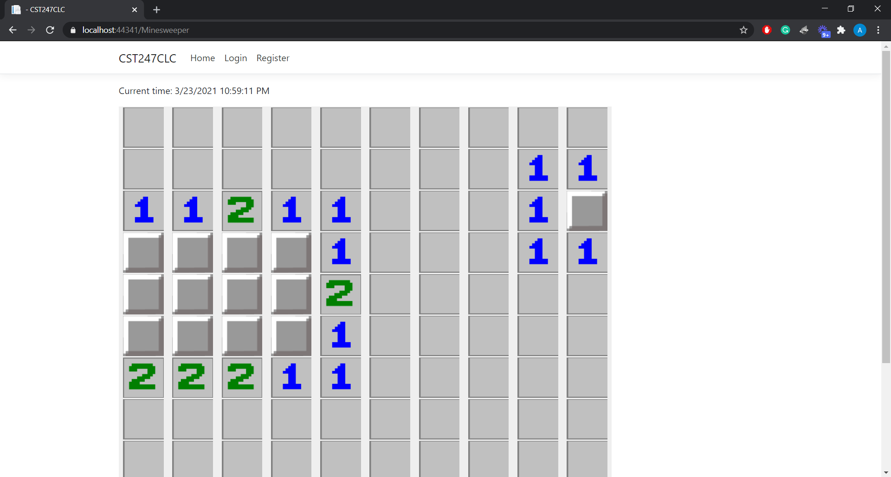
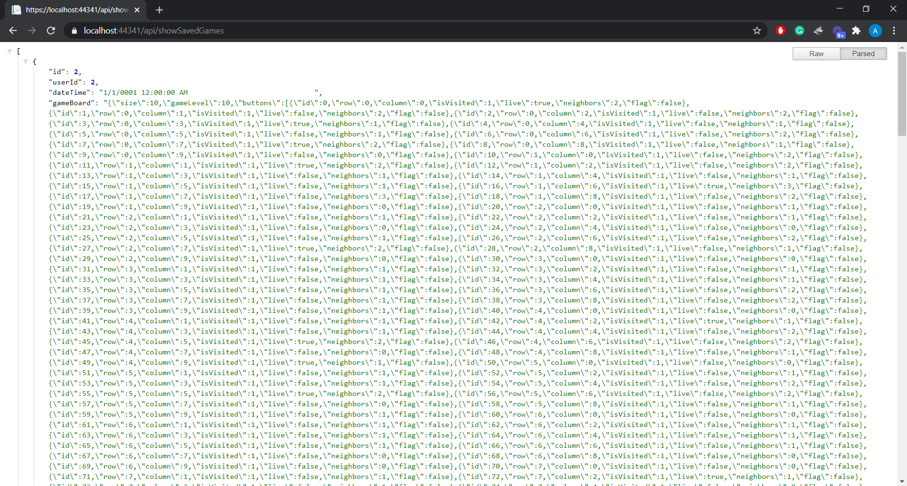

# Minesweeper .NET Core Web App
* Object-oriented
* MVC architectural pattern
* Work in progress

## Features
### Login form

* Data validation
* Login controller calls the business service to authenticate the username and password
* Business service calls the data service to perform a SELECT query in the SQL server user table

### Register form

* Data validation
* Register controller calls the business service to create the new user
* Business service calls the data service to perform an INSERT query in the SQL server user table

### Minesweeper game board

* Uses AJAX to perform partial page updates when a tile is clicked
* Games can be saved in the SQL server game board table
* Saved games can be loaded from the SQL server game board table

### API

* HttpGet used to get all saved games from the SQL server game board table
* HttpGet used to get a single saved game from the SQL server game board table using an ID parameter
* HttpDelete used to delete a single saved game from the SQL server game board table using an ID parameter
